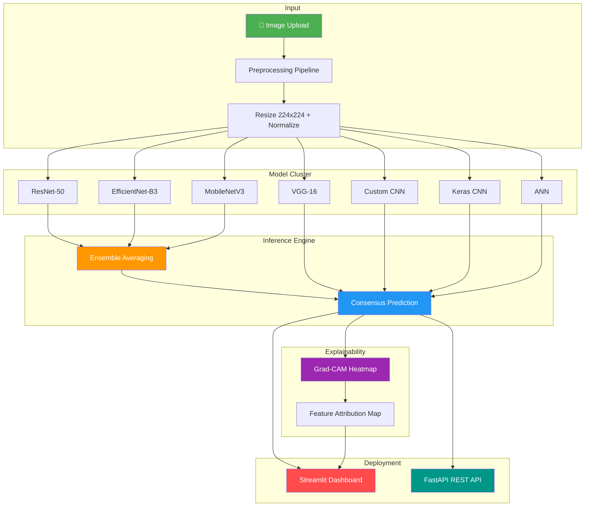

<p align="center">
  
  
  
  
  
  
</p>

<h1 align="center">👗 Multi-Model Clothing Classification System</h1>

<p align="center">
  <strong>A production-grade deep learning pipeline for automated apparel categorization featuring 7 neural network architectures, ensemble inference, Grad-CAM explainability, and full-stack deployment.</strong>
</p>

<p align="center">
  <a href="#-key-features">Features</a> •
  <a href="#-architecture">Architecture</a> •
  <a href="#-model-performance">Performance</a> •
  <a href="#-quick-start">Quick Start</a> •
  <a href="#-usage">Usage</a> •
  <a href="#-api-reference">API</a> •
  <a href="#-contributing">Contributing</a>
</p>

---

## 🎯 Key Features

| Feature | Description |
|---------|-------------|
| 🧠 **Multi-Architecture Ensemble** | 7 models (ResNet-50, EfficientNet-B3, MobileNetV3, VGG-16, ANN, Custom CNN, Keras CNN) with consensus-based inference |
| 🔍 **Grad-CAM Explainability** | Real-time spatial attention heatmaps showing exactly which features drive classification decisions |
| 📊 **20-Class Classification** | Blazer, Blouse, Dress, Hat, Hoodie, Longsleeve, Outwear, Pants, Polo, Shirt, Shoes, Shorts, Skirt, T-Shirt, Top, and more |
| 🖥️ **Interactive Dashboard** | Streamlit-based production UI with live inference, model selection, and side-by-side Grad-CAM visualization |
| ⚡ **GPU-Accelerated API** | FastAPI backend for low-latency external inference with automatic CUDA detection |
| 📈 **Comprehensive Training Pipeline** | Multi-run training with cross-validation, cosine annealing, mixed precision, and gradient accumulation |
| 🔄 **Transfer Learning** | Fine-tuned ImageNet pre-trained architectures with progressive unfreezing strategies |

---

## 🏗️ Architecture



---

## 📈 Model Performance

| Model Architecture | Training Acc. | Test/Val Acc. | Parameters | Inference Speed |
|:---|:---:|:---:|:---:|:---:|
| **EfficientNet-B3** ⭐ | 93.5% | **91.8%** | ~12M | ~15ms |
| **MobileNetV3** | 91.2% | **89.5%** | ~5.4M | ~8ms |
| **ResNet-50** | 92.0% | **88.0%** | ~25.6M | ~12ms |
| **VGG-16** | 89.8% | 86.4% | ~138M | ~25ms |
| **Keras Standard CNN** | 83.5% | 81.2% | ~15M | ~18ms |
| **Custom CNN** | 78.0% | 72.0% | ~8M | ~10ms |
| **ANN (MLP)** | 45.0% | 38.0% | ~3M | ~2ms |
| **Ensemble (Top-3)** 🏆 | — | **~92.5%** | — | ~35ms |

---

## 📁 Project Structure

```
clothing_classification_capstone/
│
├── 📂 app/                            # Deployment Interfaces
│   ├── 📄 app.py                      # Streamlit production dashboard
│   ├── 📄 fastapi_app.py              # Full FastAPI inference server
│   └── 📄 backend.py                  # API backend logic
│
├── 📂 src/core/                       # Core Library Logic
│   ├── models.py                      # Architecture definitions
│   ├── dataset.py                     # Custom dataset loader
│   ├── inference.py                   # Unified inference engine
│   ├── ensemble.py                    # Consensus predictor
│   ├── gradcam_utils.py               # Grad-CAM heatmap generator
│   └── config.py                      # Global configuration
│
├── 📂 scripts/                        # Task-specific Scripts
│   ├── train.py                       # Single-model training
│   ├── train_models_pipeline.py       # Full pipeline orchestrator
│   ├── eda.py                         # Exploratory data analysis
│   └── predict.py                     # Standalone CLI prediction
│
├── 📂 weights/                        # Trained model artifacts (LFS)
├── 📂 data/                           # Dataset images (Ignored)
├── 📂 outputs/                        # Plots & visualizations
├── 📂 reports/                        # Training logs & metrics
│
├── 📄 pyproject.toml                  # Project metadata & deps
├── 📄 Makefile                        # Automation shortcuts
├── 📄 Dockerfile                      # Containerization
└── 📄 README.md                       # Documentation
```

---

## 🚀 Quick Start

### Prerequisites

- Python 3.10+
- CUDA-capable GPU (recommended) or CPU

### Installation

```bash
# 1. Clone & Enter
git clone https://github.com/myselfsukhendu09/clothing_classification_capstone.git
cd clothing_classification_capstone

# 2. Setup (Automatic via Makefile)
make install
```

---

## 💻 Usage

### 📊 Exploratory Data Analysis
```bash
python -m scripts.eda
```

### 🧠 Model Training
```bash
# Train all models in the pipeline
make train

# Or run specific scripts
python -m scripts.train
```

### 🖥️ Launch Dashboard
```bash
make dashboard
```

### ⚡ Launch API
```bash
make api
```

---

## 🛡️ Docker Deployment
```bash
docker build -t clothing-app .
docker run -p 8501:8501 clothing-app
```

---

## 👤 Author
**Sukhendu Biswas**  
AI/ML Engineer  
[](https://github.com/myselfsukhendu09)
[](mailto:myselfsukhendu.09@gmail.com)
