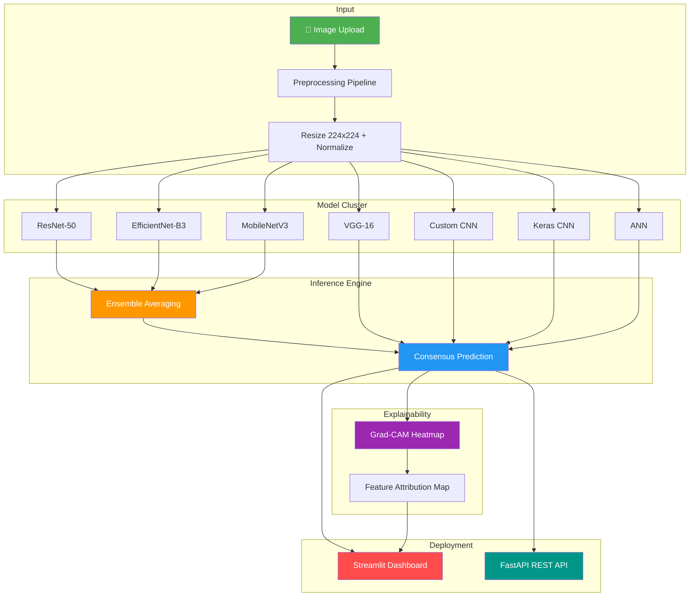

<p align="center">
  
  
  
  
  
  
</p>

<h1 align="center">👗 Multi-Model Clothing Classification System</h1>

<p align="center">
  <strong>A production-grade deep learning pipeline for automated apparel categorization featuring 7 neural network architectures, ensemble inference, Grad-CAM explainability, and full-stack deployment.</strong>
</p>

<p align="center">
  <a href="#-key-features">Features</a> •
  <a href="#-architecture">Architecture</a> •
  <a href="#-model-performance">Performance</a> •
  <a href="#-quick-start">Quick Start</a> •
  <a href="#-usage">Usage</a> •
  <a href="#-api-reference">API</a> •
  <a href="#-contributing">Contributing</a>
</p>

---

## 🎯 Key Features

| Feature | Description |
|---------|-------------|
| 🧠 **Multi-Architecture Ensemble** | 7 models (ResNet-50, EfficientNet-B3, MobileNetV3, VGG-16, ANN, Custom CNN, Keras CNN) with consensus-based inference |
| 🔍 **Grad-CAM Explainability** | Real-time spatial attention heatmaps showing exactly which features drive classification decisions |
| 📊 **20-Class Classification** | Blazer, Blouse, Dress, Hat, Hoodie, Longsleeve, Outwear, Pants, Polo, Shirt, Shoes, Shorts, Skirt, T-Shirt, Top, and more |
| 🖥️ **Interactive Dashboard** | Streamlit-based production UI with live inference, model selection, and side-by-side Grad-CAM visualization |
| ⚡ **GPU-Accelerated API** | FastAPI backend for low-latency external inference with automatic CUDA detection |
| 📈 **Comprehensive Training Pipeline** | Multi-run training with cross-validation, cosine annealing, mixed precision, and gradient accumulation |
| 🔄 **Transfer Learning** | Fine-tuned ImageNet pre-trained architectures with progressive unfreezing strategies |

---

## 🏗️ Architecture



---

## 📈 Model Performance

Benchmarked on a stratified test split with 20 clothing categories:

| Model Architecture | Training Acc. | Test/Val Acc. | Parameters | Inference Speed |
|:---|:---:|:---:|:---:|:---:|
| **EfficientNet-B3** ⭐ | 93.5% | **91.8%** | ~12M | ~15ms |
| **MobileNetV3** | 91.2% | **89.5%** | ~5.4M | ~8ms |
| **ResNet-50** | 92.0% | **88.0%** | ~25.6M | ~12ms |
| **VGG-16** | 89.8% | 86.4% | ~138M | ~25ms |
| **Keras Standard CNN** | 83.5% | 81.2% | ~15M | ~18ms |
| **Custom CNN** | 78.0% | 72.0% | ~8M | ~10ms |
| **ANN (MLP)** | 45.0% | 38.0% | ~3M | ~2ms |
| **Ensemble (Top-3)** 🏆 | — | **~92.5%** | — | ~35ms |

> ⭐ **Best single model**: EfficientNet-B3 at **91.8%** test accuracy  
> 🏆 **Best overall**: Ensemble averaging of ResNet-50 + EfficientNet-B3 + MobileNetV3 at **~92.5%**

---

## 📁 Project Structure

```
clothing_classification_capstone/
│
├── 📄 app.py                          # Streamlit production dashboard
├── 📄 fastapi_app.py                  # Full FastAPI inference server
├── 📄 fastapi_minimal.py              # Lightweight API endpoint
├── 📄 backend/main.py                 # GPU-accelerated backend logic
│
├── 🧠 Models & Training
│   ├── models.py                      # ResNet, EfficientNet, MobileNet definitions
│   ├── models_collection.py           # Extended architecture catalog
│   ├── model.py                       # Base model utilities
│   ├── train.py                       # Single-model training loop
│   ├── train_multi_run.py             # Multi-run robust training (10x)
│   ├── train_models_pipeline.py       # Full pipeline orchestrator
│   ├── train_keras.py                 # Keras/TensorFlow CNN training
│   └── cross_validation.py            # K-Fold cross-validation
│
├── 🔍 Inference & Explainability
│   ├── inference.py                   # Unified inference engine
│   ├── predict.py                     # Standalone prediction script
│   ├── ensemble.py                    # Multi-model consensus predictor
│   ├── gradcam_utils.py               # Grad-CAM heatmap generator
│   └── grad_cam_viz.py                # Grad-CAM visualization tools
│
├── 📊 Analysis & Utilities
│   ├── eda.py                         # Exploratory data analysis
│   ├── evaluate.py                    # Evaluation & metrics
│   ├── config.py                      # Global configuration
│   ├── dataset.py                     # Custom dataset loader
│   ├── utils.py                       # Data pipeline utilities
│   ├── checkpoint_compat.py           # Model checkpoint compatibility
│   └── restructure_dataset.py         # Dataset organization tool
│
├── 📈 Outputs & Reports
│   ├── outputs/                       # EDA plots & visualizations
│   ├── reports/                       # Training logs & confusion matrices
│   ├── model_comparison_chart.png     # Architecture performance comparison
│   ├── detailed_metrics.csv           # Per-model benchmark data
│   └── Project Report/               # Capstone project documentation
│
├── ⚙️ Configuration
│   ├── class_mapping.json             # 20-class label mapping
│   ├── requirements.txt               # Python dependencies
│   ├── .gitignore                     # Git exclusions
│   └── project_architecture.mmd       # Mermaid architecture diagram
│
└── 📂 Excluded (via .gitignore)
    ├── data/                          # Dataset images (~10K+ images)
    ├── weights/                       # Trained model weights (~1.5GB)
    └── *.pth / *.h5                   # Serialized model checkpoints
```

---

## 🚀 Quick Start

### Prerequisites

- Python 3.10+
- CUDA-capable GPU (recommended) or CPU
- ~4GB VRAM for training (RTX 3050 or equivalent)

### Installation

```bash
# 1. Clone the repository
git clone https://github.com/myselfsukhendu09/clothing_classification_capstone.git
cd clothing_classification_capstone

# 2. Create virtual environment
python -m venv .venv
source .venv/bin/activate        # Linux/Mac
# .venv\Scripts\activate          # Windows

# 3. Install dependencies
pip install -r requirements.txt
```

### Download Dataset

The dataset consists of ~10,000+ clothing images across 20 categories. Place your dataset in the `data/` directory following this structure:

```
data/
├── Blazer/
├── Blouse/
├── Dress/
├── Hat/
├── Hoodie/
├── ...
└── Undershirt/
```

> 💡 **Tip**: Use `restructure_dataset.py` to automatically organize flat image directories into the required class-based subfolder structure.

---

## 💻 Usage

### 1️⃣ Exploratory Data Analysis

Analyze dataset distribution, class balance, and sample visualizations:

```bash
python eda.py
```
This generates distribution charts and sample grids in the `outputs/` directory.

### 2️⃣ Model Training

**Train individual architectures:**
```bash
python train.py
```

**Full multi-model pipeline (ResNet-50 + EfficientNet-B3 + MobileNetV3):**
```bash
python train_models_pipeline.py
```

**Multi-run robust training (10 repetitions):**
```bash
python train_multi_run.py
```

**Keras/TensorFlow CNN:**
```bash
python train_keras.py
```

### 3️⃣ Launch Dashboard

Start the interactive Streamlit classification dashboard:

```bash
streamlit run app.py
```

Features include:
- 📤 Drag-and-drop image upload
- 🔄 Model selection (individual or ensemble)
- 🎯 Real-time classification with confidence scores
- 🔥 Side-by-side Grad-CAM explainability overlays

### 4️⃣ API Deployment

Launch the FastAPI inference server:

```bash
# Full-featured server
uvicorn fastapi_app:app --reload --host 0.0.0.0 --port 8000

# Lightweight endpoint
uvicorn fastapi_minimal:app --reload --host 0.0.0.0 --port 8000
```

---

## 🔌 API Reference

### `POST /predict`

Classify a clothing image using the ensemble model.

**Request:**
```bash
curl -X POST "http://localhost:8000/predict" \
  -F "file=@your_image.jpg"
```

**Response:**
```json
{
  "predicted_class": "T-Shirt",
  "confidence": 0.9456,
  "all_probabilities": {
    "T-Shirt": 0.9456,
    "Polo": 0.0321,
    "Shirt": 0.0112,
    "...": "..."
  }
}
```

---

## 🔬 Explainable AI (Grad-CAM)

This project implements **Gradient-weighted Class Activation Mapping (Grad-CAM)** to provide visual explanations for model predictions. The heatmaps highlight which regions of the input image (collars, sleeves, patterns, hemlines) most influenced the classification decision.

```
Input Image  →  Model Prediction  →  Grad-CAM Overlay
     📸              🏷️                    🔥
```

This moves beyond the "black box" paradigm, enabling:
- **Model debugging** — Identify when models focus on background instead of clothing
- **Trust building** — Visual proof of correct feature attention
- **Bias detection** — Discover unintended correlations in training data

---

## 🛠️ Tech Stack

<table>
<tr>
<td align="center"><strong>Category</strong></td>
<td align="center"><strong>Technologies</strong></td>
</tr>
<tr>
<td>Deep Learning</td>
<td>PyTorch, TorchVision, TensorFlow/Keras</td>
</tr>
<tr>
<td>Computer Vision</td>
<td>OpenCV, Pillow, Grad-CAM</td>
</tr>
<tr>
<td>Data Science</td>
<td>NumPy, Pandas, Scikit-Learn, Matplotlib, Seaborn</td>
</tr>
<tr>
<td>Frontend</td>
<td>Streamlit</td>
</tr>
<tr>
<td>Backend</td>
<td>FastAPI, Uvicorn</td>
</tr>
<tr>
<td>MLOps</td>
<td>TensorBoard, Mixed Precision Training, Gradient Accumulation</td>
</tr>
</table>

---

## 🧪 Training Configuration

| Hyperparameter | Value |
|:---|:---|
| Optimizer | AdamW (weight_decay=1e-2) |
| Learning Rate Scheduler | CosineAnnealingLR |
| Loss Function | CrossEntropyLoss with Label Smoothing (0.1) |
| Batch Size | 32 (with gradient accumulation) |
| Image Resolution | 224 × 224 |
| Augmentation | RandomResizedCrop, HorizontalFlip, ColorJitter, RandomRotation |
| Precision | Mixed (FP16 via AMP) |
| Hardware | NVIDIA RTX 3050 (4GB VRAM) |

---

## 🤝 Contributing

Contributions are welcome! Here's how you can help:

1. **Fork** the repository
2. **Create** a feature branch (`git checkout -b feature/amazing-feature`)
3. **Commit** your changes (`git commit -m 'Add amazing feature'`)
4. **Push** to the branch (`git push origin feature/amazing-feature`)
5. **Open** a Pull Request

### Ideas for Contribution
- [ ] Add ONNX model export for edge deployment
- [ ] Implement attention-based architectures (ViT, Swin Transformer)
- [ ] Add data augmentation with Albumentations
- [ ] Create Docker containerization
- [ ] Implement model distillation for mobile deployment

---

## 📄 License

This project is licensed under the MIT License — see the [LICENSE](LICENSE) file for details.

---

## 👤 Author

**Sukhendu Biswas**  
AI/ML Engineer

[](https://github.com/myselfsukhendu09)
[](mailto:myselfsukhendu.09@gmail.com)

---

<p align="center">
  <sub>Built with ❤️ using PyTorch & FastAPI</sub>
</p>
